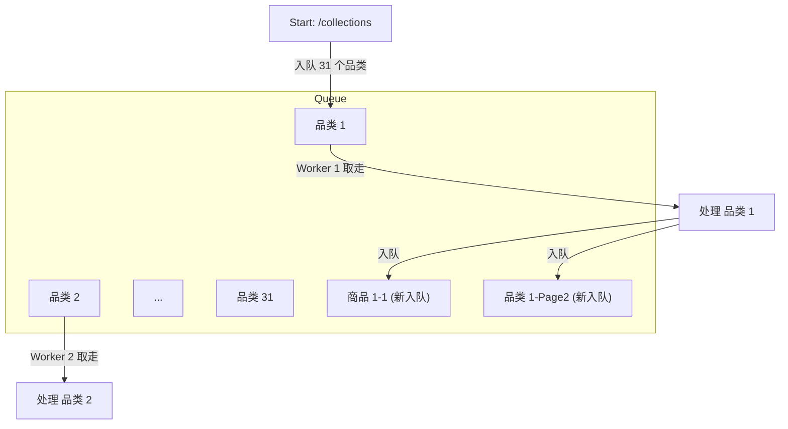

# 爬虫请求入队及处理机制解释

本文档基于 `06-real-world-project/__main__.py` 代码逻辑及对目标网站 `warehouse-theme-metal.myshopify.com` 的实际探测，详细解释 Crawlee 爬虫的链接发现、入队顺序及并发执行机制。

## 1. 实际探测结果

通过对代码逻辑的分析和实际网站结构的探测，我们还原了真实的爬取链路：

- **入口 (Level 0)**: `https://warehouse-theme-metal.myshopify.com/collections`
  - 页面上包含约 **31 个品类链接**。
  - 例如：`.../collections/tv-entertainment`, `.../collections/audio`, `.../collections/sales` 等。

- **品类页 (Level 1)**: 以 `.../collections/tv-entertainment` 为例
  - **商品链接 (Level 2)**: 页面包含具体商品链接，代码中将其打标为 `DETAIL`。
  - **下一页链接 (Level 1.5)**: 页面包含分页按钮（如 `page=2`），代码中将其打标为 `CATEGORY`。

## 2. 链接入队与爬取顺序 (广度优先策略)

Crawlee 的 `RequestQueue` 默认采用 **FIFO (先进先出)** 策略，这意味着爬虫整体上遵循 **广度优先搜索 (BFS)** 的模式。

### 第一阶段：处理入口页

1. **初始状态**: 队列中仅有 `[入口页]`。
2. **执行过程**: 爬虫抓取入口页，等待页面渲染。
3. **入队操作**: 代码执行 `await context.enqueue_links(..., label='CATEGORY')`。
   - 此操作会将页面上发现的所有 31 个品类链接一次性加入队列 **尾部**。
4. **队列状态**: `[品类1, 品类2, ..., 品类31]`。

### 第二阶段：处理品类页 (并发处理)

假设爬虫启动了多个 Worker（例如并发数为 5）：

1. **任务分配**: Worker 1~5 分别从队列头部取出 `品类1` 到 `品类5` 进行处理。
2. **处理逻辑 (以 Worker 1 处理 品类1 为例)**:
   - 发现 10 个商品链接 -> 加入队列尾部 (Label: `DETAIL`)。
   - 发现 "Next" 分页链接 -> 加入队列尾部 (Label: `CATEGORY`)。
3. **队列动态变化**:
   - **头部**: `[品类6, 品类7, ..., 品类31]` (等待被处理的初始品类)。
   - **尾部**: `[商品1-1, ..., 商品1-10, 品类1-Page2, ...]` (新发现的链接排在最后)。

**结论**: 爬虫会倾向于先处理完第一层的所有品类页 (Level 1)，然后才会大规模开始处理商品详情页 (Level 2) 和品类的分页 (Level 1.5)。

## 3. 并发 (Concurrency) 的影响

由于代码使用 `PlaywrightCrawler` 且未显式限制 `max_concurrency`，系统会自动管理并发数（通常从低并发开始，逐步增加）。

- **乱序执行**: 虽然队列严格遵循 FIFO，但由于多个 Worker 并行工作，处理速度快的页面（如内容较少的品类页）会先完成，其发现的子链接也会更早入队。
- **混合处理**: 当初始的 31 个品类页全部被 Worker 取出后，空闲下来的 Worker 才会开始处理队列中积压的 `商品链接` 和 `分页链接`。

## 4. 流程图示

## 5. 总结

1. **入队方式**: `enqueue_links` 将新发现的链接追加到队列**末尾**。
2. **爬取顺序**: 广度优先 (BFS)。优先横向爬取所有同级页面，再纵向深入。
3. **并发机制**: 多个页面并行处理，由 Crawlee 的 `autoscaled_pool` 动态调度。
